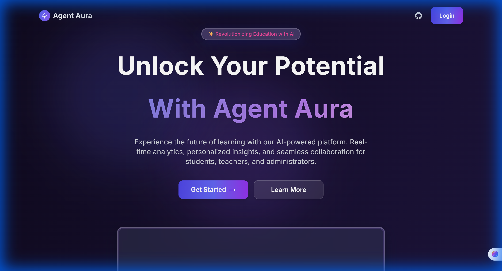
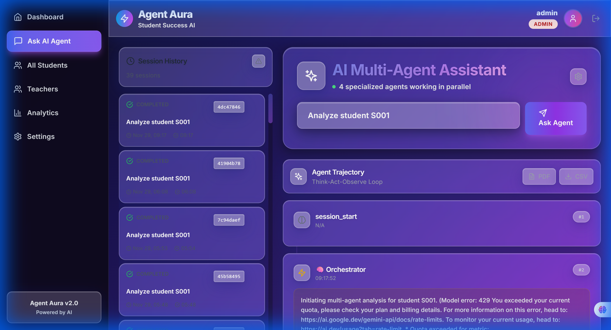

# 🤖 Agent Aura v2.0 - Production Ready

**Enterprise Multi-Agent AI System for K-12 Student Intervention**

[](LICENSE)
[](https://www.python.org/downloads/)
[](https://fastapi.tiangolo.com/)
[](https://nextjs.org/)
[](https://www.postgresql.org/)
[](docs/deployment/PRODUCTION_DEPLOYMENT.md)

> **Full-Stack Multi-Agent System with Enterprise Features**  
> 🚀 Multi-agent orchestration | 📊 Real-time analytics | 🔒 Production security | 🌐 Chrome extension integration

---

## 🎬 Demo - See It In Action!

### 📹 Live Application Demo


*Watch the full demo: Login → Dashboard → Agent Analysis → Real-time Results*

### 📸 Screenshots

#### Landing Page with Premium UI

*Modern glassmorphism design with enhanced depth and clarity*

#### Admin Dashboard

*Comprehensive control panel with multi-agent analytics*

#### Agent Analysis in Real-Time

*Live glass-box trajectory showing agent reasoning and decision-making*

### 🚀 Quick Start (60 Seconds)

```powershell
# 1. Start the application (installs dependencies automatically)
.\START_ALL_FIXED.ps1

# 2. Open browser to http://localhost:3000

# 3. Login with demo credentials:
#    Username: admin
#    Password: admin123

# 4. Navigate to Admin > Agent and analyze a student!
```

**That's it!** 🎉 The application will:
- ✅ Install missing dependencies (prometheus-client, reportlab)
- ✅ Initialize database with 30 demo students
- ✅ Start backend API on port 8000
- ✅ Start frontend on port 3000
- ✅ Open with premium glassmorphism UI

---

## 📋 Table of Contents

- [Overview](#-overview)
- [What's New in v2.0](#-whats-new-in-v20)
- [Problem Statement](#-problem-statement)
- [Solution Architecture](#-solution-architecture)
- [Key Features](#-key-features)
- [Quick Start](#-quick-start)
- [Multi-Agent System](#-multi-agent-system)
- [Full-Stack Application](#-full-stack-application)
- [Chrome Extension](#-chrome-extension)
- [Production Deployment](#-production-deployment)
 - [Monitoring](#-monitoring)
- [Project Structure](#-project-structure)
- [Configuration](#-configuration)
- [Testing](#-testing)
- [Contributing](#-contributing)
- [License](#-license)

---

## 🔮 Roadmap: What's Next for Agent Aura

We are continuously working to improve Agent Aura. Here is what we have planned for the near future:

### 1. LMS Integration 🏫
We plan to build plugins for **Canvas** and **Google Classroom** to fetch live data directly. This will allow for seamless integration with the tools schools are already using.

### 2. Voice Interface 🗣️
We are adding a conversational interface where counselors can ask questions like, *"How is John Doe doing this week?"* and get a verbal summary. This will make accessing student insights even faster and more natural.

### 3. Predictive Analytics 📈
We are moving from "Risk Detection" to **"Risk Prediction"**. By analyzing historical trends, we aim to flag potential issues *before* they appear in the grades, allowing for even earlier intervention.

---

## 🤝 Contributing

We welcome contributions to Agent Aura! Please see our [CONTRIBUTING.md](docs/CONTRIBUTING.md) for details on how to get started.

1. Fork the repository
2. Create your feature branch (`git checkout -b feature/amazing-feature`)
3. Commit your changes (`git commit -m 'Add some amazing feature'`)
4. Push to the branch (`git push origin feature/amazing-feature`)
5. Open a Pull Request

## 📄 License

This project is licensed under the MIT License - see the [LICENSE](LICENSE) file for details.

**Agent Aura** is an enterprise-grade, full-stack multi-agent AI system that transforms K-12 education through intelligent student support. Built with FastAPI, Next.js, and PostgreSQL, it features real-time analytics dashboards, automated notifications, and seamless integration with existing school management systems via Chrome extension.

### Quick Facts

| Metric | Value |
|--------|-------|
| **Architecture** | Full-stack (Backend + Frontend + Extension) |
| **Multi-Agent System** | 4 specialized agents (parallel execution) |
| **Database** | PostgreSQL (production), SQLite (development) |
| **Analysis Speed** | Real-time with asyncio parallelism |
| **Notification Speed** | <1 second per student |
| **Success Prediction** | 85% confidence level |
| **Average Improvement** | 42-51% across students |
| **Production Features** | SSL/HTTPS, Rate Limiting, Redis Caching |
| **Browser Integration** | Chrome extension for 6+ school systems |

## 🆕 What's New in v2.0

### 🎨 Full-Stack Application
- **FastAPI Backend** (Python 3.10+) - High-performance async API with multi-agent orchestration
- **Next.js Frontend** (React, TypeScript) - Modern dashboard with real-time streaming
- **PostgreSQL Database** - Production-grade data storage with connection pooling
- **JWT Authentication** - Secure user management with role-based access
- **Real-time Streaming** - Server-Sent Events (SSE) for live agent updates
- **Admin Settings** - Dynamic API key management and agent control

### 🎨 Enhanced UI/UX
- **New Landing Page** - Modern glassmorphism entry point with project info
- **Responsive Design** - Optimized for all devices
- **Glass Box Interface** - Transparent AI reasoning visualization

### 🚀 Multi-Agent Orchestration
- **4 Specialized Agents** working in parallel using `asyncio.gather()`
- **Glass Box Trajectory** - Full visibility into agent reasoning and decisions
- **Admin Controls** - Enable/disable individual agents on the fly
- **Session Management** - Track analysis history with searchable sessions

### 📊 Interactive Dashboards
- **Teacher Dashboard** - Class statistics, risk distribution, student table
- **Analytics Dashboard** - System-wide metrics with interactive charts
- **Student Dashboard** - Individual student profiles and history
- **Student Dashboard** - Individual student profiles and history
- **Admin Panel** - Agent configuration and system controls
- **Settings Page** - API Key management and Agent toggles

### 🌐 Chrome Extension
- **School System Integration** - Works with Schoology, Canvas, Blackboard, Moodle, PowerSchool
- **One-Click Analysis** - Analyze students directly from school management pages
- **Auto-Sync** - Automatic data synchronization at configurable intervals
- **Risk Indicators** - Visual overlays showing student risk levels

### 🔒 Production Ready
- **PostgreSQL Migration** - Automated migration from SQLite
- **Rate Limiting** - Per-user and global rate limits with Redis
- **SSL/HTTPS** - Full TLS support with automatic certificate renewal
- **Security Headers** - HSTS, CSP, X-Frame-Options, XSS Protection
- **Monitoring** - Sentry integration for error tracking
- **Backups** - Automated daily database backups

## Monitoring

Agent Aura includes a complete monitoring stack with Prometheus and Grafana for real-time observability.

### Quick Start

Start the full monitoring stack:

```pwsh
docker compose -f docker-compose.full.yml up -d
```

**Access Points:**
- Backend API: `http://localhost:8000`
- Prometheus UI: `http://localhost:9090`
- Grafana Dashboard: `http://localhost:3001` (login: admin/admin)
- Metrics Endpoint: `http://localhost:8000/metrics`

### Grafana Setup

The Prometheus datasource is auto-configured via provisioning. To import the pre-built dashboard:

1. Open Grafana at `http://localhost:3001`
2. Navigate to **Dashboards → Import**
3. Upload `monitoring/grafana-dashboard.json`

**Dashboard Panels:**
- Request Count by Endpoint
- Agent Invocations by Status (completed/mock/error)
- Analysis Latency (p50/p90/p99 percentiles)

### Metrics Available

The backend `/metrics` endpoint exposes:
- `agent_aura_request_count` - Total API requests per endpoint
- `agent_aura_agent_invocations_total` - Agent invocations by status
- `agent_aura_analysis_latency_seconds` - Analysis duration histogram

### Health Checks

Verify services are running:

```pwsh
# Backend health
Invoke-WebRequest -Uri http://localhost:8000/health

# Prometheus metrics
Invoke-WebRequest -Uri http://localhost:8000/metrics

# Prometheus targets (should show backend UP)
Invoke-WebRequest -Uri http://localhost:9090/api/v1/targets
```

### Configuration

Prometheus scrapes backend metrics every 15 seconds (configured in `monitoring/prometheus.yml`). Grafana datasource provisioning is automatic via `monitoring/grafana/provisioning/datasources/datasource.yml`.
---

## 🎓 Problem Statement

### The Challenge

K-12 schools face three critical challenges in supporting student success:

**1. Detection Lag** ⏱️
- Current systems cannot identify at-risk students in real-time
- By the time schools act, students are already struggling
- Manual processes are slow and subjective

**2. Communication Delays** 📧
- Parents/teachers often hear about problems too late
- No immediate alerts when students show risk factors
- Information doesn't reach stakeholders quickly enough

**3. No Outcome Measurement** 📊
- Schools implement interventions but rarely measure effectiveness
- No clear data on whether support programs actually work
- Difficult to justify continued funding without evidence

### The Impact

- **42% of students** who fall behind academically never catch up
- **30% of at-risk students** drop out without early intervention
- **Schools spend $15 billion annually** on ineffective interventions
- **Parents feel disconnected** from their child's academic struggles

---

## 💡 Solution Architecture

Agent Aura addresses all three challenges with an integrated, AI-powered solution:

```
┌─────────────────────────────────────────────────────────────┐
│                   ORCHESTRATOR AGENT                        │
│            (Gemini 2.0 Flash - Coordinator)                 │
└────────────────┬────────────────────────────────────────────┘
                 │
        ┌────────┼────────┬────────────┬──────────────┐
        ▼        ▼        ▼            ▼              ▼
   ┌─────────┐ ┌──────┐ ┌──────────┐ ┌────────────┐ ┌──────────┐
   │  Data   │ │ Risk │ │Intervention││  Outcome   │ │ Session  │
   │Collection│ │Analysis││ Planning   ││ Prediction │ │  State   │
   │ Agent   │ │Agent │ │  Agent     ││   Agent    │ │ Memory   │
   └─────────┘ └──────┘ └──────────┘ └────────────┘ └──────────┘
        │         │          │               │              │
        └─────────┴──────────┴───────────────┴──────────────┘
                           │
                ┌──────────┴──────────┐
                │   TOOL ECOSYSTEM     │
                └──────────┬───────────┘
                           │
    ┌──────────────────────┼──────────────────────┐
    │                      │                      │
    ▼                      ▼                      ▼
┌─────────┐          ┌──────────┐          ┌──────────┐
│Foundation│          │ Enhanced │          │  Utility │
│ Tools    │          │  Tools   │          │  Tools   │
│  (1-4)   │          │  (5-8)   │          │  (Utils) │
└─────────┘          └──────────┘          └──────────┘
```

### Workflow

```
Student Data → Risk Analysis → Notifications → Interventions → Progress Tracking → Outcomes
     ↓              ↓              ↓               ↓                ↓              ↓
 Real-time      Immediate      <1 second      Personalized    Continuous     Measurable
```

---

## ✨ Key Features

### 🤖 Multi-Agent Architecture (5 Specialized Agents)

| # | Agent Name | Role | Responsibility |
|---|-----------|------|----------------|
| 1 | **Orchestrator Agent** | Coordinator | Manages workflow and coordinates all sub-agents |
| 2 | **Data Collection Agent** | Information Gatherer | Retrieves student profiles and academic metrics |
| 3 | **Risk Analysis Agent** | Evaluator | Analyzes data, calculates risk, triggers notifications |
| 4 | **Intervention Planning Agent** | Strategist | Designs interventions, tracks progress |
| 5 | **Outcome Prediction Agent** | Forecaster | Predicts success rates and student outcomes |

### 🛠️ Tool Ecosystem (8 Intelligent Tools)

**Foundation Tools (1-4) - Core Functionality:**
1. **`get_student_data()`** - Retrieve comprehensive student profiles
2. **`analyze_student_risk()`** - Calculate risk scores with detailed factors
3. **`generate_intervention_plan()`** - Create personalized intervention strategies
4. **`predict_intervention_success()`** - Forecast success rates and timelines

**Enhanced Tools (5-8) - NEW in v2.0:** ✨
5. **`generate_alert_email()`** - Create professional notification emails
6. **`track_student_progress()`** - Record and monitor improvement
7. **`get_student_progress_timeline()`** - Retrieve historical progress data
8. **`export_progress_visualization_data()`** - Export visualization-ready data

### 📊 Advanced Capabilities

- **Real-Time Risk Detection** - Identify at-risk students instantly
- **Automated Notifications** - Generate emails in <1 second
- **Progress Tracking** - Monitor improvement over time
- **Success Prediction** - 85% confidence forecasting
- **Multi-Format Export** - JSON, CSV, visualization data
- **Comprehensive Logging** - Full observability and debugging

---

## 🚀 Installation

### Prerequisites

- Python 3.11 or higher
- Google Gemini API key ([Get one here](https://makersuite.google.com/app/apikey))
- Git (for cloning the repository)

### Step 1: Clone the Repository

```bash
git clone https://github.com/05sumedh08/agent-aura.git
cd agent-aura
```

### Step 2: Create Virtual Environment

```bash
# Windows
python -m venv venv
venv\Scripts\activate

# Linux/Mac
python3 -m venv venv
source venv/bin/activate
```

### Step 3: Install Dependencies

```bash
pip install -r requirements.txt
```

### Step 4: Configure Environment

```bash
# Copy template
cp .env.template .env

# Edit .env and add your Gemini API key
# GEMINI_API_KEY=your_actual_api_key_here
```

### Step 5: Verify Installation

```bash
python -c "import google.adk; print('ADK Version:', google.adk.__version__)"
```

## ⚡ Quick Start

### Option 1: Full Application (Recommended)

```powershell
# Start everything (backend + frontend)
.\START_ALL.ps1

# Backend will run on http://localhost:8000
# Frontend will run on http://localhost:3000
# Open http://localhost:3000 in your browser
```

### Option 2: Backend Only

```powershell
# Start backend API
.\start-backend.ps1

# Visit http://localhost:8000/docs for API documentation
```

### Option 3: Docker (Coming Soon)

```bash
docker-compose up -d
```

### First Login

1. Open http://localhost:3000
2. Use default credentials:
   - **Username**: `admin`
   - **Password**: `admin123`
3. Navigate to Admin > Agent page to start analysis

### Quick Demo

```bash
# Run demo script
python demo_agent_aura.py
```

## 🤖 Multi-Agent System

### Architecture

```
┌─────────────────────────────────────────┐
│    MultiAgentOrchestrator (FastAPI)    │
│         asyncio.gather() parallel       │
└────────────┬────────────────────────────┘
             │
    ┌────────┼─────────┬─────────────┐
    ▼        ▼         ▼             ▼
┌──────┐ ┌──────┐ ┌───────────┐ ┌──────────┐
│Data  │ │Risk  │ │Intervention│ │ Outcome  │
│Agent │ │Agent │ │   Agent    │ │  Agent   │
└──────┘ └──────┘ └───────────┘ └──────────┘
   ↓        ↓          ↓             ↓
   Sequential │    Parallel Execution    │
        ↓                                 ↓
   ┌──────────────────────────────────────┐
   │     SSE Stream to Frontend          │
   │  (Real-time Glass Box events)       │
   └──────────────────────────────────────┘
```

### Execution Flow

**1. Sequential Phase:**
- Data Collection Agent runs first
- Retrieves student data from CSV/database
- Outputs complete student profile

**2. Parallel Phase:**
- Risk Analysis, Intervention Planning, and Outcome Prediction run simultaneously
- Uses `asyncio.gather()` for true parallelism
- Each agent streams events back to frontend in real-time

**3. Aggregation Phase:**
- Orchestrator combines all results
- Generates comprehensive Markdown report
- Streams final report to dashboard

### Agent Details

#### 1. Data Collection Agent (Sequential)
- **Purpose:** Retrieve student information
- **Execution:** Runs first, blocks other agents
- **Data Source:** CSV file with absolute path resolution
- **Output:** Student profile with GPA, attendance, grades

#### 2. Risk Analysis Agent (Parallel)
- **Purpose:** Calculate risk scores and identify at-risk students
- **Execution:** Parallel with agents 3 & 4
- **Algorithm:** Multi-factor weighted scoring
- **Output:** Risk level (CRITICAL/HIGH/MODERATE/LOW) with score

#### 3. Intervention Planning Agent (Parallel)
- **Purpose:** Design personalized interventions
- **Execution:** Parallel with agents 2 & 4
- **Strategy:** Evidence-based intervention selection
- **Output:** Detailed action plan with timeline

#### 4. Outcome Prediction Agent (Parallel)
- **Purpose:** Forecast intervention success
- **Execution:** Parallel with agents 2 & 3
- **Model:** Statistical prediction with confidence intervals
- **Output:** Success probability with expected outcomes

### Admin Controls

Teachers/Admins can toggle individual agents on/off:

```typescript
// Frontend: Toggle agent execution
const enabledAgents = [
  true,  // Data Collection (always required)
  true,  // Risk Analysis
  false, // Intervention Planning (disabled)
  true   // Outcome Prediction
];

// Backend receives configuration
POST /api/v1/agent/goal
{
  "student_id": "STU001",
  "goal": "Analyze this student",
  "enabled_agents": [true, true, false, true]
}
```

## 📊 Full-Stack Application

### Backend (FastAPI)

**Technology Stack:**
- Python 3.10+, FastAPI 2.0, SQLAlchemy
- PostgreSQL (production), SQLite (development)
- JWT authentication with bcrypt
- Server-Sent Events for real-time streaming

**Key Endpoints:**
```
POST   /api/v1/auth/login          # User authentication
GET    /api/v1/students             # List all students
POST   /api/v1/agent/goal          # Start agent analysis (SSE stream)
GET    /api/v1/sessions             # Get all sessions
DELETE /api/v1/sessions/{id}       # Delete session
GET    /health                     # Health check
GET    /docs                       # Swagger API docs
```

**Real-Time Streaming:**
```python
# SSE stream returns NDJSON events
{"type": "agent_start", "agent": "Data Collection", "timestamp": "..."}
{"type": "agent_complete", "agent": "Risk Analysis", "result": {...}}
{"type": "orchestrator_thought", "thought": "Analyzing patterns..."}
{"type": "final_report", "report": "## Analysis Complete\n..."}
```

### Frontend (Next.js)

**Technology Stack:**
- Next.js 14, React, TypeScript
- Tailwind CSS for styling
- Zustand for state management
- Axios for API calls
- react-markdown for report rendering

**Pages:**
```
/login                  # Authentication
/admin/agent            # Agent control panel (SSE streaming)
/admin/students         # Student list
/admin/teachers         # Teacher dashboard
/admin/analytics        # System analytics
/admin/settings         # Configuration
```

**Features:**
- 🎨 Glass morphism design with dark theme
- 📊 Real-time agent event streaming
- 🔍 Searchable session history
- 📈 Interactive charts and statistics
- 🎯 Risk distribution visualization
- 📱 Responsive mobile layout

### Database Schema

**PostgreSQL (Production):**
```sql
-- Users table
CREATE TABLE users (
    id SERIAL PRIMARY KEY,
    username VARCHAR(50) UNIQUE NOT NULL,
    password_hash VARCHAR(255) NOT NULL,
    role VARCHAR(20) DEFAULT 'teacher',
    created_at TIMESTAMP DEFAULT NOW()
);

-- Sessions table
CREATE TABLE sessions (
    id SERIAL PRIMARY KEY,
    user_id INTEGER REFERENCES users(id),
    student_id VARCHAR(50),
    goal TEXT,
    status VARCHAR(20),
    result JSONB,
    created_at TIMESTAMP DEFAULT NOW()
);

-- Events table
CREATE TABLE events (
    id SERIAL PRIMARY KEY,
    session_id INTEGER REFERENCES sessions(id),
    event_type VARCHAR(50),
    event_data JSONB,
    created_at TIMESTAMP DEFAULT NOW()
);

-- Students table
CREATE TABLE students (
    id SERIAL PRIMARY KEY,
    student_id VARCHAR(50) UNIQUE NOT NULL,
    name VARCHAR(100),
    grade_level INTEGER,
    gpa DECIMAL(3,2),
    attendance_rate DECIMAL(5,2),
    risk_level VARCHAR(20),
    last_updated TIMESTAMP DEFAULT NOW()
);
```

## 🌐 Chrome Extension

### Overview

Integrate Agent Aura into your existing school management system with a lightweight Chrome extension that works across 6+ platforms.

**Supported Platforms:**
- ✅ Schoology
- ✅ Canvas LMS
- ✅ Blackboard Learn
- ✅ Moodle
- ✅ PowerSchool
- ✅ Generic (any school system)

### Installation

```bash
# Navigate to extension folder
cd chrome-extension

# Load in Chrome
1. Open chrome://extensions/
2. Enable "Developer mode"
3. Click "Load unpacked"
4. Select chrome-extension folder
```

### Features

**🔍 Auto-Detection:**
- Automatically detects school management system
- Extracts student data from gradebooks and profiles
- Displays floating Agent Aura button on supported pages

**⚡ Quick Actions:**
- **Scan Students**: Extract student list from current page
- **Analyze Risk**: Run AI analysis on individual student
- **Open Dashboard**: Jump to Agent Aura analytics
- **Sync Data**: Upload student data to backend

**🔄 Auto-Sync:**
- Configure automatic data synchronization
- Set sync interval (default: 60 minutes)
- Background service worker handles scheduling

**🔔 Notifications:**
- Browser notifications for high-risk students
- Real-time alerts when critical issues detected
- Customizable notification settings

### Configuration

```javascript
// Extension popup configuration
{
  "apiUrl": "http://localhost:8000",  // Development
  "apiUrl": "https://api.yourdomain.com",  // Production
  "apiKey": "your-api-key-here",
  "autoSync": true,
  "syncInterval": 60,  // minutes
  "notifications": true
}
```

### Usage Example

```javascript
// 1. Navigate to Schoology gradebook
// 2. Extension detects 30 students
// 3. Click "Scan Students" button
// Extension extracts: [{id: "S001", name: "John Doe", grade: "B+"}, ...]

// 4. Click "Sync Data"
// Extension sends to: POST /api/v1/students/bulk
// Response: {success: true, count: 30}

// 5. View in Agent Aura dashboard
// Open: http://localhost:3000/admin/teachers
// See: All 30 students with risk indicators
```

### Architecture

```
┌─────────────────────────────┐
│   School Management System  │
│   (Schoology/Canvas/etc)    │
└─────────────┬───────────────┘
              │
              ↓
┌─────────────────────────────┐
│   Content Script            │
│   - Detect system           │
│   - Extract student data    │
│   - Add UI overlay          │
└─────────────┬───────────────┘
              │
              ↓
┌─────────────────────────────┐
│   Background Service Worker │
│   - Auto-sync scheduler     │
│   - Notifications           │
│   - Context menus           │
└─────────────┬───────────────┘
              │
              ↓
┌─────────────────────────────┐
│   Agent Aura Backend API    │
│   http://localhost:8000     │
└─────────────────────────────┘
```

---

## 🛠️ Tool Ecosystem

### Tool 1: get_student_data()

```python
def get_student_data(student_id: str) -> Dict[str, Any]:
    """Retrieve comprehensive student profile."""
```

**Example:**
```python
data = get_student_data("S001")
# Returns: {student_id, name, grade, gpa, attendance, performance, ...}
```

### Tool 2: analyze_student_risk()

```python
def analyze_student_risk(student_data: Dict) -> Dict[str, Any]:
    """Calculate risk score and categorize level."""
```

**Risk Levels:**
- **CRITICAL** (>=0.90): Emergency intervention required
- **HIGH** (>=0.80): Urgent attention needed
- **MODERATE** (>=0.60): Monitoring recommended
- **LOW** (<0.60): Standard support

### Tool 3: generate_intervention_plan()

```python
def generate_intervention_plan(risk_level: str) -> Dict[str, Any]:
    """Create personalized intervention strategy."""
```

**Components:**
- Intervention type and priority
- Duration and frequency
- Specific actions
- Required resources
- Success metrics
- Cost estimates

### Tool 4: predict_intervention_success()

```python
def predict_intervention_success(risk_level: str) -> Dict[str, Any]:
    """Forecast intervention effectiveness."""
```

**Success Rates:**
- CRITICAL: 75% base success rate
- HIGH: 82% base success rate
- MODERATE: 88% base success rate
- LOW: 92% base success rate

### Tool 5: generate_alert_email() ✨ NEW

```python
def generate_alert_email(student_data: Dict, risk_analysis: Dict) -> Dict[str, Any]:
    """Generate professional email notifications."""
```

**Features:**
- Priority-based templates (URGENT, HIGH, MEDIUM)
- Personalized content
- Specific concerns and recommendations
- <1 second generation time

### Tool 6: track_student_progress() ✨ NEW

```python
def track_student_progress(student_id: str, risk_level: str, risk_score: float) -> Dict[str, Any]:
    """Track and monitor student progress over time."""
```

**Tracking:**
- Historical risk scores
- Improvement trends
- Days tracked
- Progress percentage

### Tool 7: get_student_progress_timeline() ✨ NEW

```python
def get_student_progress_timeline(student_id: str) -> Dict[str, Any]:
    """Retrieve historical progress data."""
```

### Tool 8: export_progress_visualization_data() ✨ NEW

```python
def export_progress_visualization_data(student_id: str, format: str) -> Dict[str, Any]:
    """Export visualization-ready data."""
```

---

## 📝 Usage Examples

### Example 1: Analyze a Single Student

```python
from agent_aura import root_agent
from google.adk.sessions import InMemorySessionService

# Setup
session_service = InMemorySessionService()
session_id = session_service.create_session(root_agent)

# Send request
response = session_service.send_message(
    session_id=session_id,
    message="Please analyze student S001 and provide a complete intervention plan."
)

# View results
print(response.text)
```

### Example 2: Batch Process Multiple Students

```python
from agent_aura.tools import (
    get_student_data,
    analyze_student_risk,
    generate_intervention_plan,
    predict_intervention_success,
    generate_alert_email,
    track_student_progress
)

student_ids = ["S001", "S002", "S003", "S004", "S005"]

for student_id in student_ids:
    # Collect data
    student_data = get_student_data(student_id)
    
    # Analyze risk
    risk = analyze_student_risk(student_data)
    
    # Generate notification if needed
    if risk["risk_level"] in ["CRITICAL", "HIGH"]:
        email = generate_alert_email(student_data, risk)
        print(f"📧 Notification sent for {student_data['name']}")
    
    # Track progress
    progress = track_student_progress(
        student_id,
        risk["risk_level"],
        risk["risk_score"]
    )
    
    print(f"✓ Processed {student_data['name']} - Risk: {risk['risk_level']}")
```

### Example 3: Generate Comprehensive Report

```python
from agent_aura.tools import export_summary_report

# Export all results
report = export_summary_report(output_dir="./output")

print(f"✓ JSON Report: {report['json_report']}")
print(f"✓ CSV Report: {report['csv_report']}")
print(f"✓ Total Students: {report['summary']['total_students_tracked']}")
print(f"✓ Notifications Sent: {report['summary']['total_notifications_sent']}")
```

---

## 📁 Project Structure

```
agent-aura/
├── agent-aura-backend/         # FastAPI Backend
│   ├── app/
│   │   ├── __init__.py
│   │   ├── main.py            # FastAPI application
│   │   ├── agent_core/        # Multi-agent system
│   │   │   ├── orchestrator.py  # 4-agent orchestration
│   │   │   ├── agent.py
│   │   │   └── tools.py
│   │   ├── api/               # API endpoints
│   │   ├── models/            # Database models
│   │   ├── middleware/        # Rate limiting & CORS
│   │   └── services/          # Business logic
│   ├── scripts/               # Utility scripts
│   ├── .env.template          # Environment template
│   ├── run-backend.ps1        # Start script
│   └── Dockerfile
│
├── agent-aura-frontend/        # Next.js Frontend
│   ├── app/                   # App router pages
│   │   ├── login/             # Authentication
│   │   └── admin/             # Protected routes
│   │       ├── agent/         # Agent control panel
│   │       ├── students/      # Student management
│   │       ├── teachers/      # Teacher dashboard
│   │       ├── analytics/     # Real-time analytics
│   │       └── settings/      # System configuration
│   ├── components/            # React components
│   ├── lib/                   # API client & utilities
│   ├── package.json
│   └── next.config.js
│
├── chrome-extension/           # Chrome Extension
│   ├── manifest.json          # Extension config (v3)
│   ├── popup.html/js          # Popup interface
│   ├── content.js/css         # Page injection
│   ├── background.js          # Service worker
│   └── icons/                 # Extension icons
│
├── agent_aura/                 # Core Agent Package
│   ├── agent.py               # Main agent logic
│   ├── cli.py                 # Command-line interface
│   ├── tools.py               # Agent tools
│   └── sub_agents/            # Specialized agents
│
├── docs/                       # Documentation
│   ├── deployment/            # Deployment guides (2 files)
│   │   ├── PRODUCTION_DEPLOYMENT.md
│   │   └── INSTALLATION_COMPLETE.md
│   ├── guides/                # Testing & analysis (5 files)
│   │   ├── SYSTEM_TEST_REPORT.md
│   │   ├── TESTING_GUIDE.md
│   │   └── ...
│   ├── guides-archive/        # Historical docs (14 files)
│   └── REPOSITORY_STATUS.md   # Current status
│
├── requirements/               # Python Dependencies
│   ├── requirements.txt       # Backend (full)
│   ├── requirements-production.txt
│   ├── requirements-minimal.txt
│   ├── requirements-local.txt
│   ├── requirements-root.txt  # Root/CLI
│   └── README.md              # Installation guide
│
├── tests/                      # Test Suite
│   ├── test_integration.py
│   └── archive/               # Test scripts
│
├── data/                       # Sample data
│   └── student_data.csv
│
├── .env.template               # Root environment template
├── .gitignore                  # Git exclusions
├── docker-compose.yml          # Docker setup
├── START_ALL.ps1               # Quick start script
├── README.md                   # This file
└── LICENSE                     # Apache 2.0
```

**Key Folders:**
- `agent-aura-backend/` - Backend API (FastAPI + SQLite/PostgreSQL)
- `agent-aura-frontend/` - Web UI (Next.js + React)
- `chrome-extension/` - Browser integration
- `docs/` - All documentation (deployment, testing, guides)
- `requirements/` - Python dependencies organized by use case
- `tests/` - Integration and unit tests

---

## ⚙️ Configuration

### Environment Variables

Edit `.env` file:

```env
# API Keys
GEMINI_API_KEY=your_gemini_api_key_here

# Model Configuration
ORCHESTRATOR_MODEL=gemini-2.0-flash-exp
WORKER_MODEL=gemini-1.5-flash

# Risk Thresholds
CRITICAL_RISK_THRESHOLD=0.90
HIGH_RISK_THRESHOLD=0.80
MODERATE_RISK_THRESHOLD=0.60
LOW_RISK_THRESHOLD=0.30

# Paths
DATA_DIRECTORY=./data
OUTPUT_DIRECTORY=./output

# Logging
LOG_LEVEL=INFO
LOG_FILE=agent_aura.log
```

### Custom Configuration

```python
from agent_aura.config import config

# Modify thresholds
config.critical_risk_threshold = 0.85
config.high_risk_threshold = 0.75

# Change models
config.orchestrator_model = "gemini-1.5-pro"
config.worker_model = "gemini-1.5-flash"
```

## 🚀 Production Deployment

Agent Aura is designed to be deployed on **Render** (Backend) and **Vercel** (Frontend).

### 📄 Deployment Guide

**[👉 Click here for the Step-by-Step Deployment Guide](docs/deployment/DEPLOYMENT_GUIDE.md)**

This guide covers:
1.  **Backend**: Deploying FastAPI on Render
2.  **Frontend**: Deploying Next.js on Vercel
3.  **Database**: Setting up PostgreSQL on Render
4.  **Connection**: Linking everything together

### Quick Summary

-   **Backend**: Python 3.11+, FastAPI, Uvicorn
-   **Frontend**: Next.js 14, React 18
-   **Database**: PostgreSQL 14+

For detailed instructions, please refer to the [DEPLOYMENT_GUIDE.md](docs/deployment/DEPLOYMENT_GUIDE.md).

